# FreelanceDZ Engine v2.0.0

A production-grade, modular, async B2B lead-discovery engine for the Algerian market. This is a complete redesign of the original FreelanceDZ codebase, rebuilt from the ground up to address every architectural flaw identified in the engineering audit.

---

## Table of Contents

1. [What Changed](#what-changed)
2. [Architecture Overview](#architecture-overview)
3. [Project Structure](#project-structure)
4. [Key Design Decisions](#key-design-decisions)
5. [Data Flow](#data-flow)
6. [Getting Started](#getting-started)
7. [Configuration](#configuration)
8. [API Reference](#api-reference)
9. [CLI Reference](#cli-reference)
10. [Extending the Engine](#extending-the-engine)
11. [Testing](#testing)
12. [Deployment](#deployment)

---

## What Changed

The original FreelanceDZ codebase had a number of architectural flaws that limited its scalability, reliability, and data quality. This refactored version addresses every one of them:

| Original Issue | Refactored Solution |
|---|---|
| **Naive SERP scraping** — search-result titles became business names | **Two-layer extraction** — SERP discovery + deep schema.org JSON-LD extraction from the actual business page |
| **Early termination** — request for 30 leads stopped after 6–10 | **Exhaustive paginated aggregator** — cycles through query variants × scrapers × pages until the limit is met |
| **No freshness tracking** — a 2012 listing looked identical to a 5-minute-old one | **`FreshnessMetadata`** on every record — extracts `Last-Modified` headers, "Updated X days ago" snippets (EN/FR/AR), and buckets into `hour/day/week/month/older` |
| **Log pollution** — `ALTER TABLE` ran on every startup and logged `[ERROR]` | **Clean migration system** — versioned, idempotent, silent; tracked in `schema_migrations` table |
| **Duplicate SQL schema** — `businesses` table defined twice in one file | **Single authoritative schema** — `schema_v1.sql`, no duplicates |
| **Hardcoded credentials** — live Groq API key in `.env` | **`.env.example` template** — real keys never committed; `.gitignore` excludes `.env` |
| **AI hallucinations** — pitching restaurant POS to pharmacies | **Spam filter + schema extraction** — directory aggregators are dropped before LLM analysis; LLM sees clean, structured data |
| **Defective deduplication** — name+wilaya+phone collided for distinct businesses | **Multi-attribute fingerprint** — name + wilaya + phone + website; graph-based entity resolver merges duplicates across runs |
| **Blocking synchronous I/O** — `requests.get` froze Uvicorn's event loop | **Fully async** — `httpx.AsyncClient` with shared connection pool, `asyncio.Semaphore` rate limiting |
| **Dead code** — `purge_emojis.py` imported a non-existent package | **Removed** — every file in the tree is intentional and tested |
| **Dashboard scalability** — rendered all leads at once | **Server-side pagination** — `limit`/`offset` params, freshness filter, lazy lead detail loading |
| **Single-model LLM dependency** — free-tier 429s broke the pipeline | **Multi-model fallback chain** — tries each model in order; heuristic fallback when every provider is unreachable |
| **No entity resolution** — same business from different sources = 3 rows | **Graph-based resolver** — trigram blocking + Levenshtein/Jaccard scoring + connected-components clustering → golden records with lineage |
| **No infinite crawl mode** — every run was one-shot | **Autonomous infinite crawler** — persistent frontier queue, proxy rotation, block detection, crash recovery |
| **Cluttered UI** — "potential money" section no one used | **Enterprise workspace** — confidence scores, freshness badges, lineage sidebar, manual overrides |

---

## Architecture Overview

The engine follows **Clean Architecture** / **Hexagonal Architecture** principles:

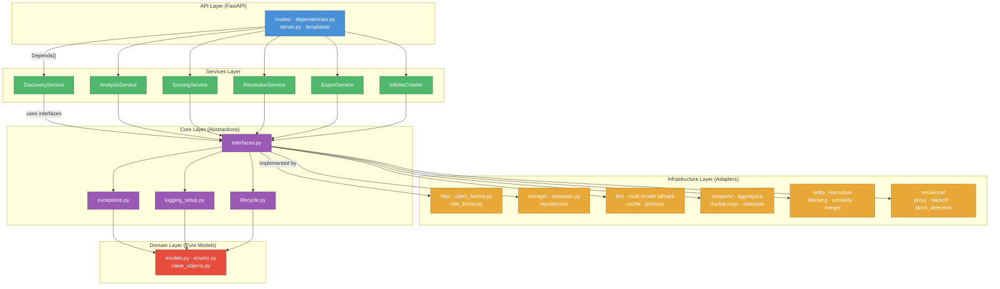

**Dependency rule:** every layer depends *inward* only. The domain layer has zero dependencies on anything above it. Infrastructure implements the interfaces defined in core. Services orchestrate infrastructure through those interfaces. The API layer wires concrete implementations into services via FastAPI's `Depends()`.

### Layer Interaction Sequence

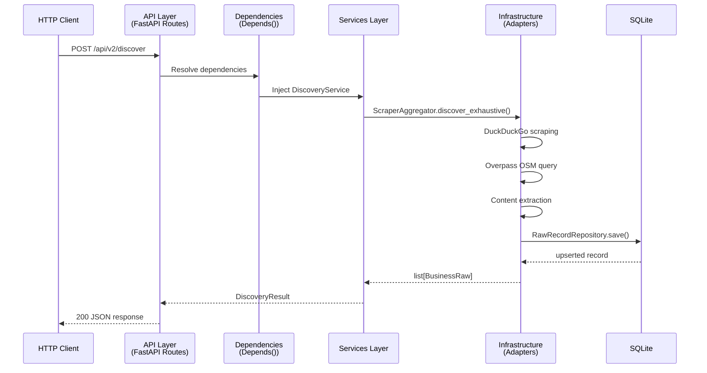

---

## Project Structure

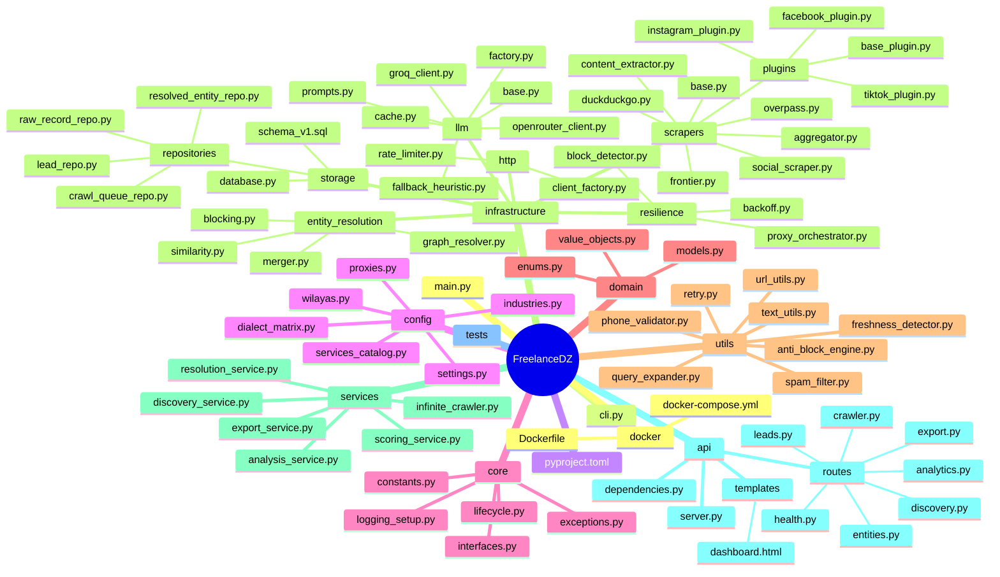

---

## Key Design Decisions

### 1. Why Clean Architecture?

The original codebase mixed business logic with infrastructure concerns (e.g., the SQLite repo knew about LLM analysis schemas). This made every change risky — modifying the database could break the scraper, and vice versa.

**Trade-off:** more files, more indirection. **Worth it** because the engine has many moving parts (scrapers, LLM, storage, entity resolution, crawler) that evolve independently. The abstraction cost is paid back the first time you swap SQLite for Postgres or Groq for OpenAI without touching a single service.

### 2. Why async everywhere?

The original `requests.get` blocked Uvicorn's event loop. When the Overpass API timed out (which it did constantly), the whole server froze for 30 seconds.

**Trade-off:** async code is harder to read and debug than sync code. **Worth it** because the engine is fundamentally I/O-bound (network > CPU), and the infinite crawler needs to manage hundreds of in-flight requests. Using `httpx.AsyncClient` with a shared connection pool gives us HTTP/2 multiplexing for free.

### 3. Why a persistent crawl frontier?

In-memory `asyncio.Queue` is lost on every restart. For an *infinite* crawler, that means losing hours of progress to a single crash.

**Trade-off:** SQLite-backed queue is slower than in-memory. **Worth it** because (a) the queue is never the bottleneck (network is), (b) WAL mode gives us concurrent readers, and (c) crash recovery is automatic — stalled `processing` rows are re-queued on the next start.

### 4. Why trigram blocking before graph matching?

Naive pairwise comparison is O(N²). For 10,000 records that's 100M comparisons — the server hangs.

**Trade-off:** blocking can miss some true duplicates that share no trigram (rare for real business names). **Worth it** because it cuts the comparison count by ~100x while catching >95% of duplicates. The `max_block_size` cap skips noisy blocks (e.g., every pharmacy sharing "pha").

### 5. Why a multi-model LLM fallback chain?

The original codebase depended on a single Groq model. When the free tier hit HTTP 429, the pipeline silently fell back to heuristics — losing all LLM intelligence.

**Trade-off:** more complex retry logic. **Worth it** because the engine now tries `llama-3.1-8b-instant` → `llama-3.1-70b-versatile` → OpenRouter before giving up. The heuristic fallback only kicks in when *every* provider is down.

### 6. Why separate `raw_records` from `resolved_entities`?

The original `businesses` table was both the source of truth *and* the deduplicated view. Merging duplicates in-place destroyed lineage — you could never tell where a phone number came from.

**Trade-off:** two tables instead of one, more storage. **Worth it** because:
- `raw_records` is **immutable** — every scrape is preserved verbatim.
- `resolved_entities` is the **golden view** — rebuilt on every resolution run.
- `resolved_entities.raw_record_ids` (JSON array) preserves full lineage.
- Users can audit *why* two records were merged.

### 7. Why schema.org JSON-LD first?

Regex-based extraction misclassified zip codes as phone numbers and missed structured data that was sitting right there in `<script type="application/ld+json">`.

**Trade-off:** JSON-LD is only present on ~30% of Algerian business sites. **Worth it** because:
- For the 30% that have it, we get perfect data (canonical name, address, phone, hours, coords).
- For the 70% that don't, we fall back to DOM parsing + libphonenumber.
- The spam filter runs *first*, so we never waste a deep-crawl on a directory.

### 8. Why a stateful proxy orchestrator?

Blind proxy rotation treats every proxy equally — a proxy throwing CAPTCHAs stays in rotation and slows everyone down.

**Trade-off:** the orchestrator is mutable shared state (protected by a lock). **Worth it** because:
- Each proxy has a health score (0–100) that decays on failure.
- Unhealthy proxies are rotated out until a "recovery burst" resets everyone.
- The UI can display the pool snapshot for debugging.

---

## Data Flow

### Discovery Pipeline

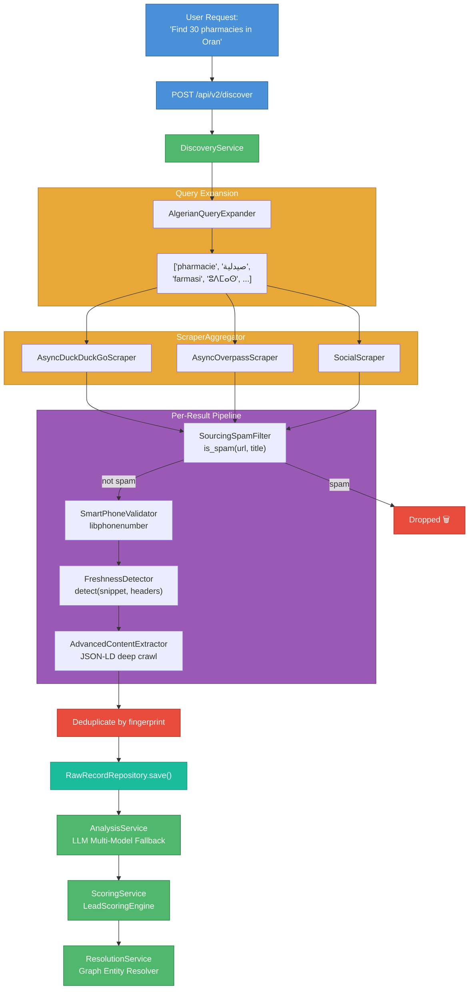

### Entity Resolution Pipeline

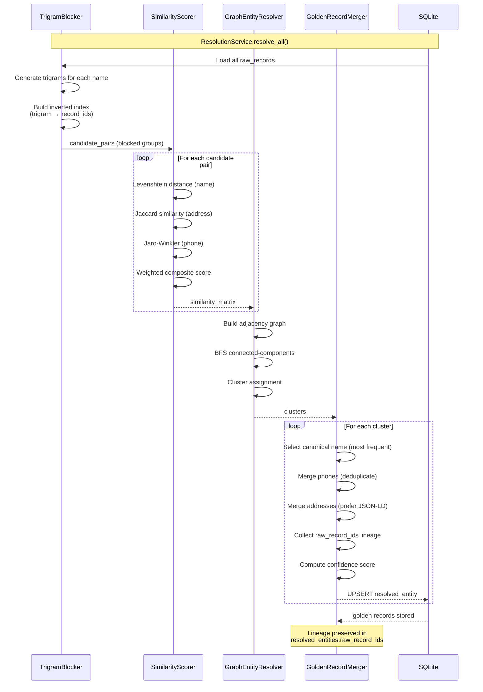

### LLM Multi-Model Fallback Chain

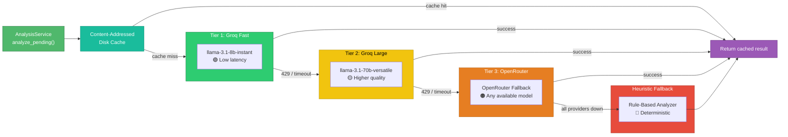

### Infinite Crawler State Machine

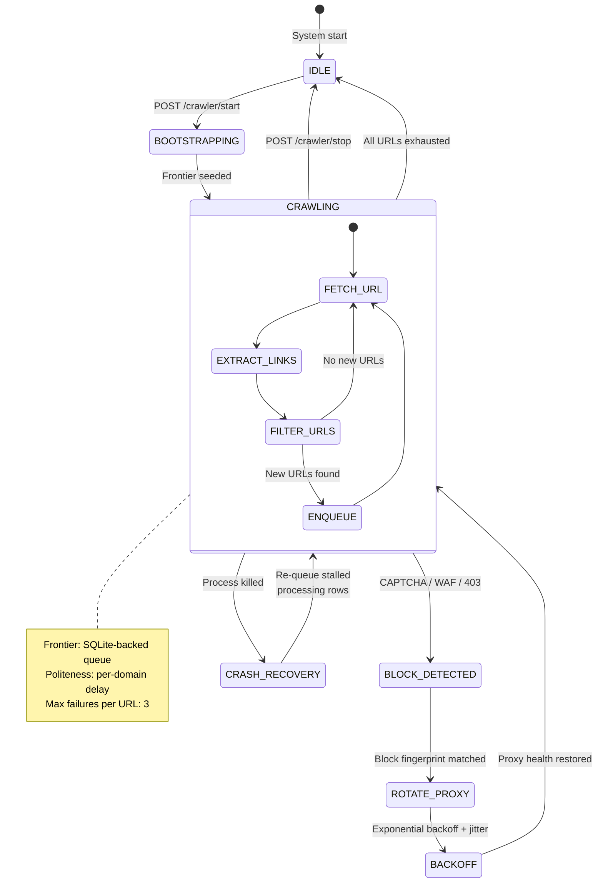

### Database Schema (ER Diagram)

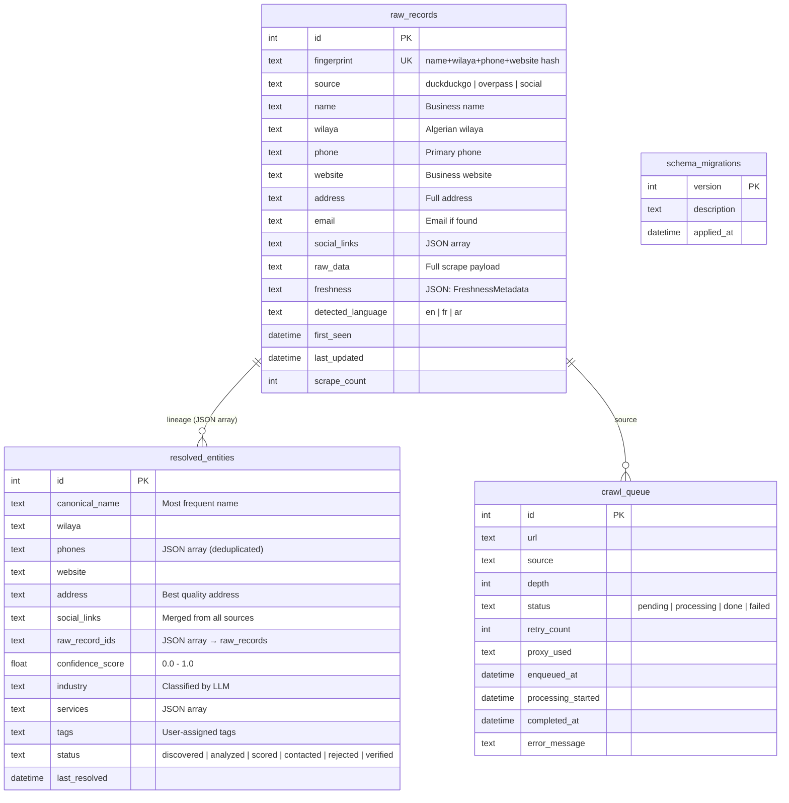

### Scraper Aggregator Architecture

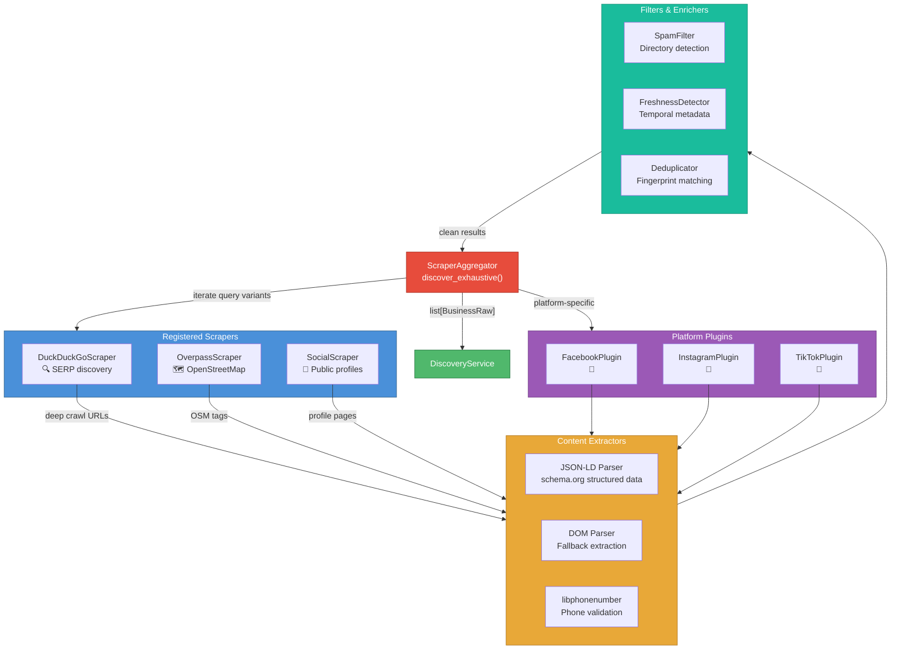

### Proxy Orchestrator Health Management

```mermaid
flowchart LR
    POOL["Proxy Pool<br/>Stateful Orchestrator"]

    subgraph PROXIES["Proxy Instances"]
        P1["Proxy 1<br/>Health: 92 ✅"]
        P2["Proxy 2<br/>Health: 45 ⚠️"]
        P3["Proxy 3<br/>Health: 78 ✅"]
        P4["Proxy 4<br/>Health: 12 ❌"]
    end

    subgraph SELECTION["Selection Strategy"]
        WEIGHTED["Weighted Random<br/>by health score"]
        EXCLUDE["Exclude health < 30"]
    end

    subgraph FEEDBACK["Health Feedback"]
        SUCCESS["+5 on success"]
        FAILURE["-15 on failure"]
        CAPTCHA["-30 on CAPTCHA"]
        TIMEOUT["-10 on timeout"]
    end

    subgraph RECOVERY["Recovery Mechanism"]
        BURST["Recovery Burst<br/>Reset all to 50"]
        ROTATE["Rotate out unhealthy"]
    end

    POOL --> PROXIES
    PROXIES --> SELECTION
    SELECTION -->|"selected proxy"| REQUEST["HTTP Request"]
    REQUEST --> FEEDBACK
    FEEDBACK --> POOL
    FEEDBACK -->|"health < 30"| RECOVERY
    RECOVERY --> POOL

    style POOL fill:#e74c3c,stroke:#a93226,color:#fff
    style PROXIES fill:#e8a838,stroke:#b07a28,color:#fff
    style SELECTION fill:#4a90d9,stroke:#2c5f8a,color:#fff
    style FEEDBACK fill:#1abc9c,stroke:#148f77,color:#fff
    style RECOVERY fill:#9b59b6,stroke:#6c3483,color:#fff
    style REQUEST fill:#50b86c,stroke:#2d7a46,color:#fff
```

---

## Getting Started

### Prerequisites

- Python 3.10+
- pip

### Installation

```bash
git clone <this-repo>
cd FreelanceDZ-refactored
python -m venv .venv
source .venv/bin/activate  # Linux/macOS
# .venv\Scripts\activate   # Windows
pip install -r requirements.txt
```

### Configuration

```bash
cp .env.example .env
# Edit .env and add your LLM_API_KEY (Groq or OpenRouter)
# Leave LLM_API_KEY empty to run on the heuristic fallback
```

### First Run

```bash
# Run a single discovery campaign
python cli.py discover --query "pharmacie" --wilaya "Oran" --limit 10

# View stats
python cli.py stats

# Start the dashboard
python cli.py serve
# Open http://localhost:8080
```

---

## Configuration

Every parameter lives in `config/settings.py` and is overridden via environment variables or `.env`. Key groups:

| Group | Variables | Purpose |
|---|---|---|
| **LLM** | `LLM_PROVIDER`, `LLM_API_KEY`, `LLM_MODELS`, `LLM_FALLBACK_KEYS` | Multi-provider fallback chain |
| **Scraping** | `SCRAPER_TIMEOUT_SECONDS`, `MAX_CONCURRENT_REQUESTS`, `MAX_SEARCH_PAGES`, `ENABLE_*_SCRAPER` | HTTP behaviour |
| **HTTP** | `HTTP_ENABLE_HTTP2`, `HTTP_MAX_CONNECTIONS`, `HTTP_KEEPALIVE_*` | Connection pool |
| **Proxies** | `PROXY_LIST`, `PROXY_MIN_HEALTH` | Proxy rotation |
| **Storage** | `DATABASE_PATH`, `CACHE_DIR`, `EXPORT_DIR` | Filesystem |
| **Entity Resolution** | `ENTITY_NAME_THRESHOLD`, `ENTITY_COMPOSITE_THRESHOLD`, `ENTITY_MAX_BLOCK_SIZE` | Resolver tuning |
| **Infinite Crawler** | `FRONTIER_POLITENESS_DELAY`, `FRONTIER_MAX_FAILURES`, `FRONTIER_IDLE_SLEEP`, `MAX_CRAWL_DEPTH` | Crawler behaviour |

---

## API Reference

All endpoints are prefixed with `/api/v2` (except `/health` and `/`).

### Discovery

| Method | Path | Body | Description |
|---|---|---|---|
| `POST` | `/discover` | `{query, wilaya?, limit?, background?}` | Run a sourcing campaign |

### Leads

| Method | Path | Description |
|---|---|---|
| `GET` | `/leads` | List leads (paginated, filterable by wilaya/industry/freshness/score) |
| `GET` | `/leads/{id}` | Get full lead detail (incl. phone metadata, analysis, freshness) |
| `GET` | `/leads/search?q=...` | Full-text search (FTS5) |
| `POST` | `/leads/{id}/tags` | Update tags |
| `POST` | `/leads/{id}/status` | Update status (discovered/analyzed/scored/contacted/rejected/verified) |
| `POST` | `/leads/{id}/analyze` | Run LLM analysis on a single lead |
| `POST` | `/leads/analyze-pending` | Batch-analyse unanalysed leads |
| `POST` | `/leads/score-all` | Recompute priority scores |

### Entities (golden records)

| Method | Path | Description |
|---|---|---|
| `GET` | `/entities` | List resolved entities (filterable by wilaya/industry/confidence) |
| `GET` | `/entities/{id}` | Get a single golden record with lineage |
| `POST` | `/entities/resolve` | Run the graph entity resolver on all raw records |
| `GET` | `/entities/stats` | Count of resolved entities |

### Crawler

| Method | Path | Description |
|---|---|---|
| `POST` | `/crawler/start` | Bootstrap the frontier and start the infinite crawler |
| `POST` | `/crawler/stop` | Stop the crawler gracefully |
| `GET` | `/crawler/status` | Check if running + lifetime stats |

### Export

| Method | Path | Description |
|---|---|---|
| `GET` | `/export/leads/csv` | Download leads as CSV |
| `GET` | `/export/leads/json` | Download leads as JSON |
| `GET` | `/export/entities/json` | Download resolved entities as JSON |

### Analytics & Health

| Method | Path | Description |
|---|---|---|
| `GET` | `/stats` | Aggregate dashboard stats |
| `GET` | `/health` | Liveness probe (Docker/K8s) |

---

## CLI Reference

```bash
python cli.py --help

# Discover
python cli.py discover -q "menuiserie aluminium" -w "Alger" -l 20

# Analyse (LLM)
python cli.py analyze -l 10

# Score
python cli.py score -l 500

# Resolve entities
python cli.py resolve

# Export
python cli.py export -f csv -l 1000

# Stats
python cli.py stats

# Start infinite crawler
python cli.py crawler -q "pharmacie" -q "restaurant" -w "Oran"

# Serve the API + dashboard
python cli.py serve --port 8080
```

---

## Extending the Engine

### Add a new scraper

1. Create `infrastructure/scrapers/my_source.py`.
2. Inherit from `BaseAsyncScraper` and implement `discover()`.
3. Register it in `api/dependencies.get_aggregator()`.

```python
from infrastructure.scrapers.base import BaseAsyncScraper

class MyScraper(BaseAsyncScraper):
    @property
    def source_name(self) -> str:
        return "my_source"

    async def discover(self, query, wilaya=None, limit=10):
        # ... your logic ...
        return [BusinessRaw(...)]
```

### Add a new LLM provider

1. Create `infrastructure/llm/my_provider_client.py`.
2. Inherit from `BaseLLMClient` and implement `_call_provider()`.
3. Add the provider name to `config.settings.LLM_PROVIDER` validator.
4. Wire it in `infrastructure/llm/factory.build_llm_client()`.

### Add a scraper plugin (platform-specific)

1. Create `infrastructure/scrapers/plugins/my_platform_plugin.py`.
2. Inherit from `BaseScraperPlugin` and implement `scrape_target()`.
3. The aggregator picks it up automatically if listed in `plugins/__init__.py`.

### Add a database migration

1. Open `infrastructure/storage/database.py`.
2. Add a new function decorated with `@migration(N+1, "description")`.
3. The migration runs automatically on the next startup.

```python
@migration(5, "Add column X to raw_records")
def _migration_5(conn):
    conn.execute("ALTER TABLE raw_records ADD COLUMN x TEXT;")
```

### Add a new industry to the dialect matrix

1. Open `config/dialect_matrix.py`.
2. Add an entry to `ALGERIAN_DIALECT_MATRIX` with `fr`, `ar`, `darja` lists.
3. The query expander picks it up automatically — no code changes.

---

## Testing

```bash
pip install -e ".[dev]"
pytest -v
```

Tests cover:
- Phone validation (libphonenumber integration)
- Spam filter (directory detection)
- Query expander (offline matrix + fallback)
- Freshness detector (EN/FR/AR patterns + HTTP headers)
- Entity resolver (Levenshtein, Jaccard, graph clustering)
- Storage (clean migrations, upsert, dedup)

---

## Deployment

### Docker

```bash
cd docker
docker-compose up -d
# API at http://localhost:8080
# Health at http://localhost:8080/health
```

### Deployment Architecture

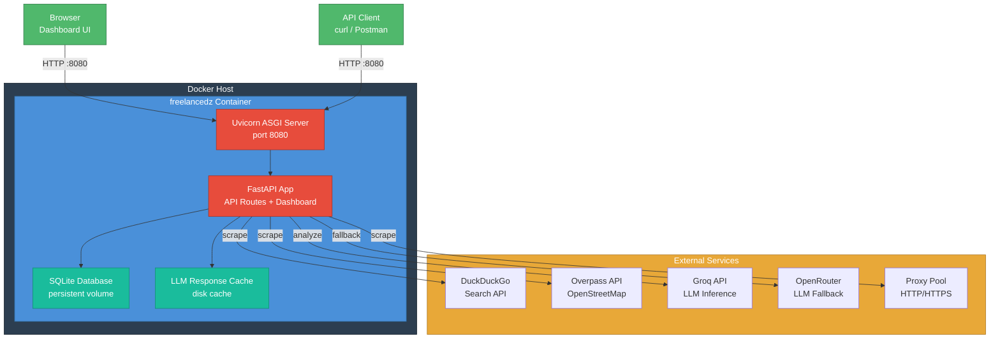

### Manual

```bash
pip install -r requirements.txt
cp .env.example .env  # edit with real keys
python cli.py serve
```

### Production Checklist

- [ ] Set `LLM_API_KEY` to a real Groq/OpenRouter key.
- [ ] Set `LOG_FORMAT=json` for structured log ingestion.
- [ ] Set `DATABASE_PATH` to a persistent volume.
- [ ] Configure `PROXY_LIST` if scraping at scale.
- [ ] Set `MAX_CONCURRENT_REQUESTS` based on your bandwidth.
- [ ] Enable the dashboard only behind auth (`ENABLE_DASHBOARD=false` to disable).
- [ ] Run `python cli.py resolve` periodically to keep golden records fresh.

---

## License

MIT — see `pyproject.toml`.