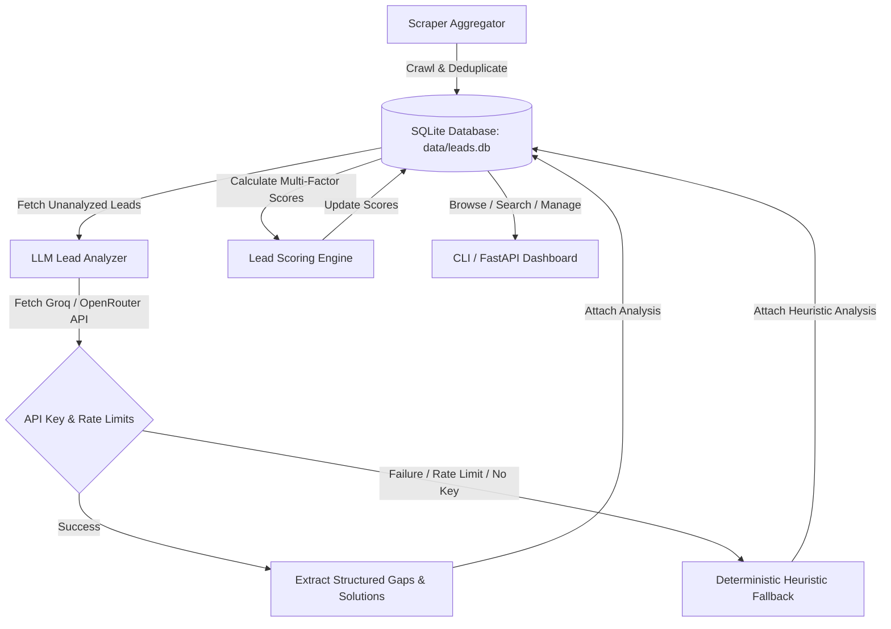

# DZ Sales Intelligence — Platform Manual

An AI-powered **business discovery, gap analysis, and lead scoring platform** built specifically for the Algerian market. It aggregates public data from OpenStreetMap and search engines, uses free-tier Large Language Models (LLMs) to identify operational and digital gaps, and scores each lead (0–100) to find high-value prospects for software services.

---

## 📖 Architecture & Data Flow



### Clean Architecture Layout
- **`domain/`**: Pure data models (Pydantic) and exceptions. Free of external I/O.
- **`core/`**: Abstract interfaces/contracts representing scrapers, repositories, and scorers.
- **`infrastructure/`**: Concrete implementations of scrapers (Overpass QL, DuckDuckGo), LLM API clients (Groq, OpenRouter), cache directories, and SQLite database repository.
- **`services/`**: Core orchestration engines (Pipeline, Analyzer, Scorer).
- **`config/`**: Operational settings, wilaya indices (58 Algerian wilayas), and industry templates.
- **`api/`**: Web-facing REST endpoints and Jinja2-based dashboard.

---

## ⚙️ Setup & Credential Safety

To prevent security leaks, credentials must **never** be committed to the repository. 

1. Ensure `.env` is listed in your `.gitignore` so your actual keys are kept local:
   ```bash
   echo ".env" >> .gitignore
   ```
2. Copy the template to build your local credentials:
   ```bash
   cp .env.example .env
   ```
3. Edit `.env` to configure your LLM settings (either Groq or OpenRouter).

### Configuration Options (`.env`)

| Variable | Description | Default |
|---|---|---|
| `LLM_PROVIDER` | LLM client to use (`groq` or `openrouter`). | `groq` |
| `LLM_API_KEY` | Your secret API key. Do NOT share or commit this. | *(None)* |
| `LLM_API_BASE` | Base URL for LLM completions. | `https://api.groq.com/openai/v1` |
| `LLM_MODEL` | The LLM model to query. | `llama-3.1-8b-instant` |
| `RATE_LIMIT_DELAY_SECONDS` | Delay between consecutive API queries. | `3.0` |
| `LLM_MAX_RETRIES` | Max retry attempts for API 429 errors. | `4` |
| `ENABLE_LLM_CACHE` | Enable local disk caching for LLM responses. | `true` |
| `ENABLE_OVERPASS_SCRAPER` | Enable querying OpenStreetMap for leads. | `true` |
| `ENABLE_DDG_SCRAPER` | Enable searching DuckDuckGo. | `true` |
| `ENABLE_MOCK_SCRAPER` | Enable fake local generator (for offline testing). | `true` |
| `DATABASE_PATH` | Path to SQLite database. | `./data/leads.db` |

---

## 🚀 The Prospecting Pipeline: How it Works

The pipeline executes in three distinct phases:

### Phase 1: Business Discovery (Scraping)
- **Overpass Scraper**: Construct-queries OpenStreetMap Overpass servers to find nodes matching the query inside the selected Wilaya boundary.
- **DuckDuckGo Scraper**: Queries search engines to locate listings, website URLs, and Facebook/Instagram links.
- **Mock Scraper**: Generates synthetic, realistic local businesses to allow developers to build features without internet connection or API credits.
- **Deduplication**: Every business generates a unique SHA-256 fingerprint based on its normalized `name`, `wilaya`, and `industry`. If a business already exists in the database, it is automatically skipped.

### Phase 2: LLM Gap Analysis (AI Assessment)
- The system requests the LLM to identify pain points (e.g. manual record keeping, lack of reservation portals) and suggest custom software solutions (e.g. POS systems, websites, inventory control).
- **Caching**: The query outcome is saved in `data/cache/llm/` using the business fingerprint and prompt version. If you run analysis again, it loads instantly from disk.
- **Fallback Heuristic**: If you lack an API key, get rate-limited (HTTP 429), or the network is down, the system **automatically falls back to a rule-based algorithm** that pulls templates from `config/industries.py` to populate realistic solutions, and digital presence scores. **The pipeline never crashes.**

### Phase 3: Priority Scoring
The `LeadScoringEngine` computes a priority score from `0.0` to `100.0` based on four weighted factors:
1. **Digital Gap (40 points max)**: 20 pts if they lack a website; 10 pts if website exists but LLM score is low; 10 pts if they lack social media; 5 pts if they lack a public phone number.
2. **Activity Signal (30 points max)**: Capped review count (20 pts) and low Google/OSM ratings (10 pts) showing reputation room.
3. **Deal Size (20 points max)**: Higher estimated project valuations yield higher points.
4. **Industry Multiplier (10 points max)**: High-value industries (e.g., medical, logistics) receive bonus points.

---

## 🛠️ CLI Reference Manual

Run the CLI using `.venv/bin/python cli.py <command>`.

### 1. `pipeline` (Full Run)
Runs the entire sequence: discover → analyze → score → display leaderboard.
```bash
python cli.py pipeline --query "clinique" --wilaya "Algiers" --limit 15
```
- `--query, -q` *(Required)*: Category to search.
- `--wilaya, -w`: Name of the Algerian Wilaya.
- `--limit, -l`: Maximum new items to discover (default: 10).

### 2. `discover`
Crawl external sources and save raw leads.
```bash
python cli.py discover --query "hotel" --wilaya "Oran" --limit 10
```

### 3. `analyze`
Perform LLM analysis on pending leads.
```bash
python cli.py analyze --limit 50
# Force re-analysis of all leads
python cli.py analyze --force
# Verify LLM connection and exit
python cli.py analyze --health-check
```

### 4. `score`
Recompute priority scores for all leads in the database.
```bash
python cli.py score --limit 500
```

### 5. `top`
Show the ranked leaderboard of leads.
```bash
python cli.py top --n 10 --wilaya "Oran"
```

### 6. `search`
Search database using full-text matching on name, industry, or wilaya.
```bash
python cli.py search --term "Hakka"
```

### 7. `stats`
Display database statistics.
```bash
python cli.py stats
```

### 8. `export`
Export leads to CSV, JSON, or Markdown formats.
```bash
python cli.py export --format csv --out ./data/exports/leads.csv
```

### 9. `status`
Set a custom status for a lead.
```bash
python cli.py status 12 contacted
```

### 10. `cache-clear`
Delete cached LLM completions.
```bash
python cli.py cache-clear
```

### 11. `config`
Print active configurations (with masked API keys).
```bash
python cli.py config
```

---

## 🖥️ Web Dashboard

Start the FastAPI web server to browse leads interactively:
```bash
python cli.py serve --port 8080
```
- Open **http://localhost:8080** to view the interactive table.
- Open **http://localhost:8080/docs** to read the REST API OpenAPI documentation.

### Core API Endpoints
- `GET /api/stats`: Retrieve current statistics.
- `GET /api/leads`: Search/Filter leads with limit/offset.
- `GET /api/leads/{id}`: Detailed business details + digital gap analysis.
- `POST /api/leads/{id}/status`: Set status to `contacted`, `rejected`, etc.

---

## 🔍 What Works vs. Known Limitations

### ✅ What Works
* **Robust offline fallbacks**: If you exceed your LLM tier or lose connection, mock scrapers and heuristic analysis keep the pipeline fully operational.
* **Deterministic caching**: Re-running the pipeline on identical leads uses zero LLM credits.
* **Strict Deduplication**: Prevents database clutter even if you run scrapers multiple times.
* **Jinja2 UI Compatibility**: Switched to modern keyword arguments for `TemplateResponse` to avoid Jinja2 hashing crashes.
* **Overpass QL Regex Fix**: Case-insensitive queries to OSM servers are stable (`["name"~"query",i]`).

### ⚠️ Limitations & Edge Cases
* **DuckDuckGo Rate Limits**: DuckDuckGo search queries will throttle or block your IP temporarily if you request leads in rapid succession. Use the `RATE_LIMIT_DELAY_SECONDS` variable to keep query frequency low.
* **OpenStreetMap Data Coverage**: OpenStreetMap depends on crowdsourced edits. Some rural Algerian wilayas might return few or no nodes. Use `discover` with DDG or fallback scrapers for these areas.
* **LLM Output Parsers**: Occasionally, cheap LLM models fail to return valid JSON structures. The parser is built to intercept these anomalies and use heuristic fallbacks for the fields that failed.
* **Coordinates Limitation**: Coordinates (latitude, longitude) are only available for OpenStreetMap results. Leads discovered solely via DuckDuckGo search results will have these fields set to null.
